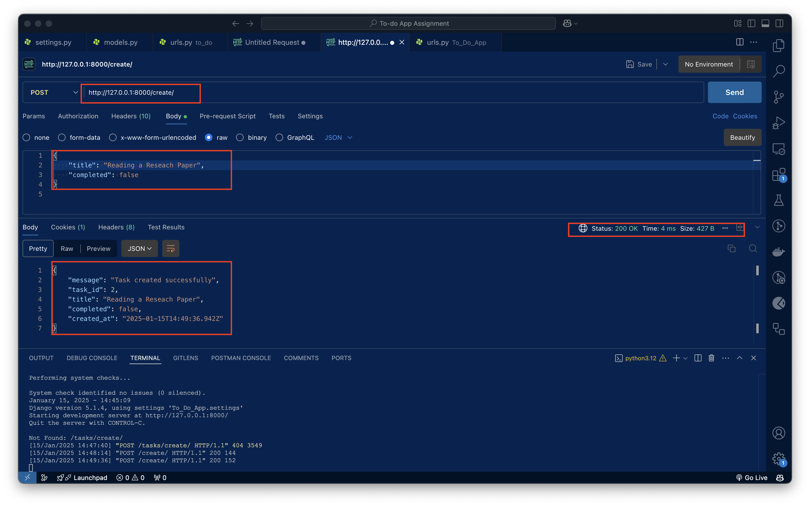
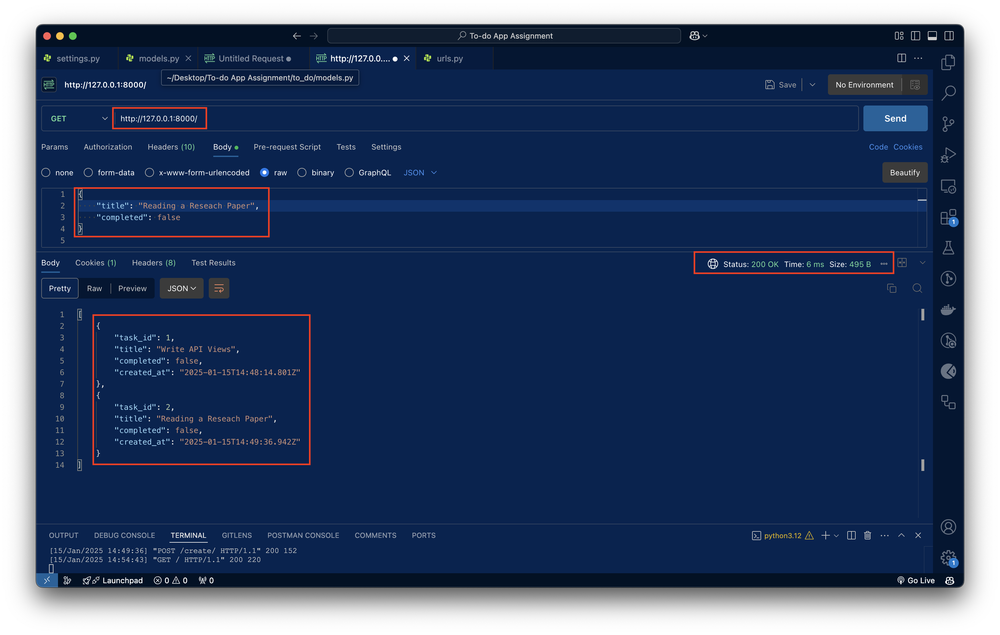
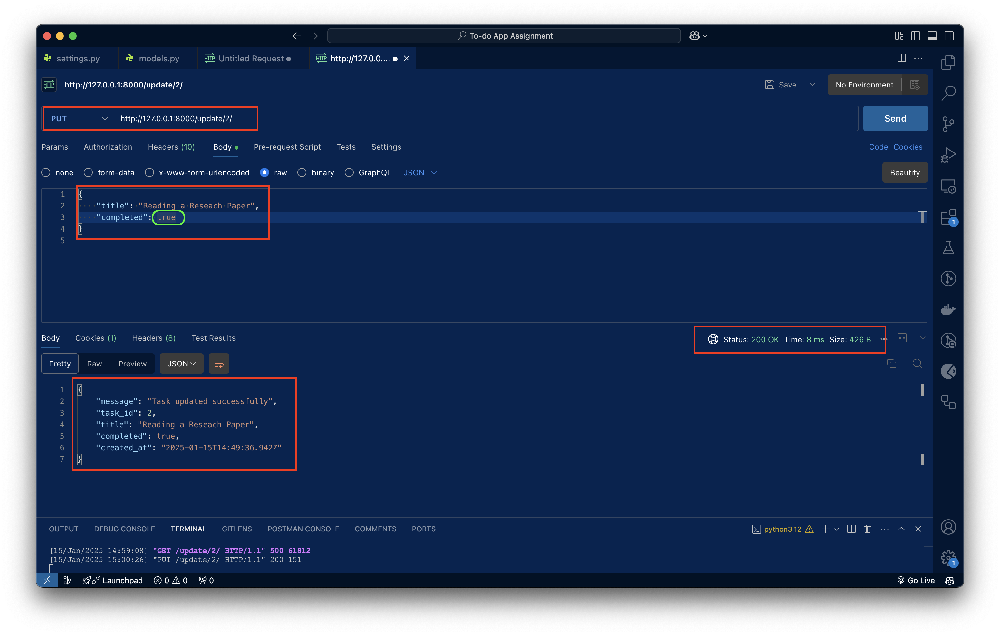
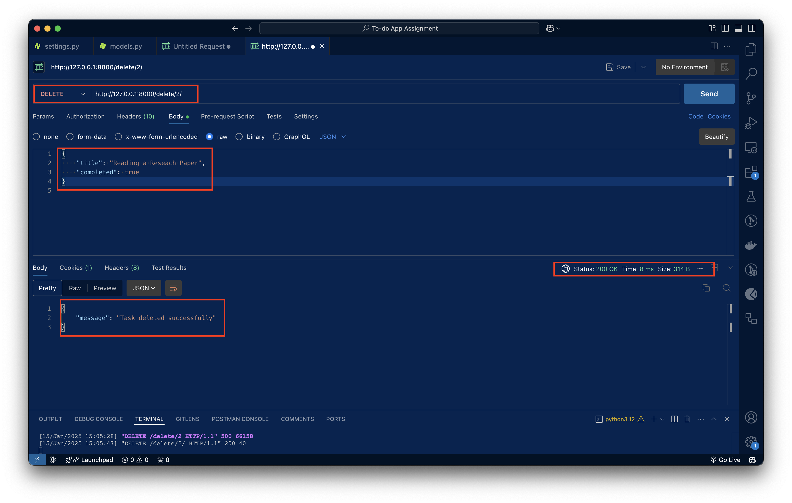

# To-Do App with Django & PostgreSQL

This project is a simple To-Do app built using Django and PostgreSQL. It allows you to manage tasks, marking them as completed or pending, with the ability to create, read, update, and delete tasks.

## Features
- Task management (CRUD operations)
- PostgreSQL as the database

## Prerequisites

Before starting, ensure you have the following installed:
- Python (version 3.8 or higher)
- Conda (for creating isolated environments)
- PostgreSQL (for the database)

## Setting up the Environment

1. **Clone the Repository:**

   Clone the project repository to your local machine.

   ```bash
   git clone https://github.com/pravincoder/to-do-app.git
    ```


2. **Create the Conda Environment:**
    You can create a Conda environment for this project using the provided environment.yaml file.
    ```bash
    conda env create -f environment.yaml
    ```

3. **Activate the Conda Environment:**

    Once the environment is created, activate it with:
    ```bash
    conda activate to_do-web-app
    ```

## Setting up PostgreSQL

1. **Install PostgreSQL (if not already installed):**
If PostgreSQL is not already installed on your machine, you can install it by following the official PostgreSQL installation guide.

2. **Create a Database:**

    After installing PostgreSQL, create a database for the project:

    ```bash
    psql postgres
    CREATE DATABASE todo_app;
    ```
 - Ensure that your PostgreSQL service is running before proceeding. You can start PostgreSQL using:

    ```bash
    sudo service postgresql start  # On Linux/mac
    /opt/homebrew/opt/postgresql@14/bin/postgres -D /opt/homebrew/var/postgresql@14
    ```  

- Update Database Settings in settings.py:

    Open the settings.py file located in the To_Do_App directory and update the DATABASES section to connect to PostgreSQL.

    ```python
    DATABASES = {
    'default': {
        'ENGINE': 'django.db.backends.postgresql',
        'NAME': 'todo_app',  # The database name you created
        'USER': 'postgres',   # Your PostgreSQL username
        'PASSWORD': 'yourpassword',  # Your PostgreSQL password
        'HOST': '127.0.0.1',  # Use localhost if it's running locally
        'PORT': '5432',       # Default PostgreSQL port
    }
    }
    ```

## Running the Project

1. **Migrate the Database:**
    Run the following command to create the necessary database tables:
    ```python
    python manage.py migrate
    ```

2. **Create a Superuser for Admin Panel (Optional):**
    To access the Django admin panel, create a superuser account by running:
    ```python
    python manage.py createsuperuser
    ```
    Follow the prompts to set up the admin credentials.
3. **Run the Development Server:**
    Start the Django development server with:
    ```python
    python manage.py runserver
    ```
    The app will be available at http://127.0.0.1:8000/.
4. **Access the Admin Panel:**
    You can access the Django admin panel at http://127.0.0.1:8000/admin/ by logging in with the superuser credentials you created earlier.
## API Endpoints

Below are the API endpoints for the TODO App:

### 1. **Create a New Task**
   - **Endpoint:** `POST /create/`
   - **Description:** Adds a new task to the TODO list.
   - **Request Body:**
     ```json
     {
       "title": "Task Title",
       "description": "Task Description"
     }
     ```
   - **Response:**
     ```json
     {
       "id": 1,
       "title": "Task Title",
       "description": "Task Description",
       "created_at": "2025-01-01T00:00:00Z"
     }
     ```
   - **Postman Test:**
     - In Postman, select **POST** as the HTTP method.
     - Enter the URL: `http://localhost:8000/create/`
     - In the **Body** section, select **raw** and **JSON** format, then enter the request body.
     - Click **Send** to create a new task.
    


### 2. **Get All Tasks**
   - **Endpoint:** `GET /`
   - **Description:** Retrieves all tasks in the TODO list.
   - **Response:**
     ```json
     [
       {
         "id": 1,
         "title": "Task Title",
         "description": "Task Description",
         "created_at": "2025-01-01T00:00:00Z"
       },
       {
         "id": 2,
         "title": "Another Task",
         "description": "Another Task Description",
         "created_at": "2025-01-02T00:00:00Z"
       }
     ]


     ```
   - **Postman Test:**
     - In Postman, select **GET** as the HTTP method.
     - Enter the URL: `http://localhost:8000/`
     - Click **Send** to fetch all tasks.

### 3. **Get a Specific Task**
   - **Endpoint:** `GET /viewtask/{id}/`
   - **Description:** Retrieves a specific task by its ID.
   - **Request URL:** Replace `{id}` with the task ID (e.g., `1`).
   - **Response:**
     ```json
     {
       "id": 1,
       "title": "Task Title",
       "description": "Task Description",
       "created_at": "2025-01-01T00:00:00Z"
     }
     ```
   - **Postman Test:**
     - In Postman, select **GET** as the HTTP method.
     - Enter the URL: `http://localhost:8000/viewtask/1/`
     - Click **Send** to fetch the task with ID `1`.
 
### 4. **Update a Task**
   - **Endpoint:** `PUT /update/{id}/`
   - **Description:** Updates a specific task by its ID.
   - **Request URL:** Replace `{id}` with the task ID (e.g., `1`).
   - **Request Body:**
     ```json
     {
       "title": "Updated Task Title",
       "description": "Updated Task Description"
     }
     ```
   - **Response:**
     ```json
     {
       "id": 1,
       "title": "Updated Task Title",
       "description": "Updated Task Description",
       "created_at": "2025-01-01T00:00:00Z"
     }
     ```
   - **Postman Test:**
     - In Postman, select **PUT** as the HTTP method.
     - Enter the URL: `http://localhost:8000/update/1/`
     - In the **Body** section, select **raw** and **JSON** format, then enter the request body.
     - Click **Send** to update the task.
    


### 5. **Delete a Task**
   - **Endpoint:** `DELETE  delete/{id}/`
   - **Description:** Deletes a specific task by its ID.
   - **Request URL:** Replace `{id}` with the task ID (e.g., `1`).
   - **Response:**
     ```json
     {
       "message": "Task deleted successfully"
     }
     ```
   - **Postman Test:**
     - In Postman, select **DELETE** as the HTTP method.
     - Enter the URL: `http://localhost:8000/delete/1`
     - Click **Send** to delete the task with ID `1`.



## Testing Steps in Postman

1. Open **Postman**.
2. Select the HTTP method (GET, POST, PUT, DELETE).
3. Enter the appropriate API endpoint URL.
4. If required, enter the JSON body in the **Body** tab.
5. Click **Send** to make the request.
6. Observe the response returned by the API in the **Response** section.

## Conclusion

By following the steps above, you can easily test the TODO App API endpoints using Postman. Ensure that your app is running locally, and the endpoints are accessible via `http://localhost:8000/`.


## Contributing

Feel free to fork the repository and submit a pull request with any improvements or bug fixes. Contributions are always welcome!


